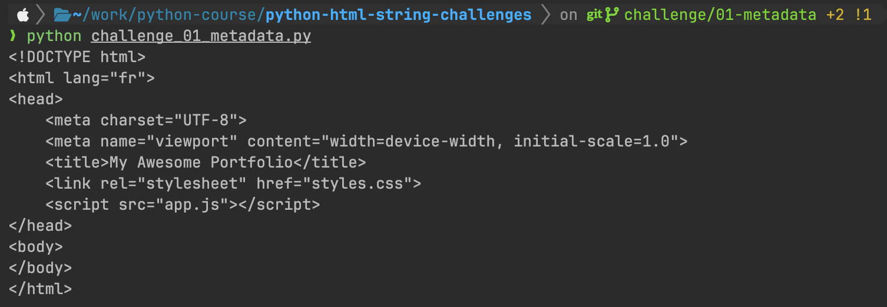
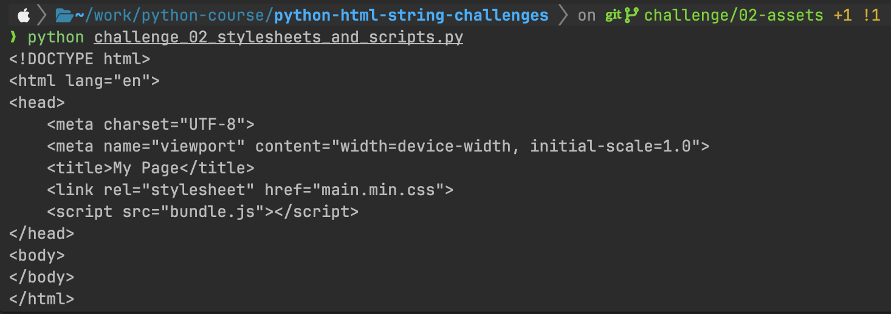
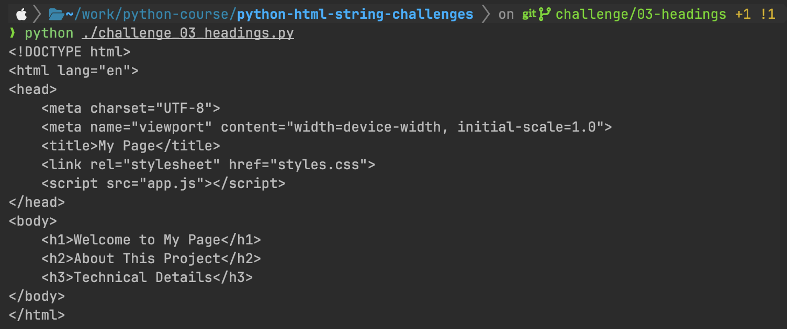
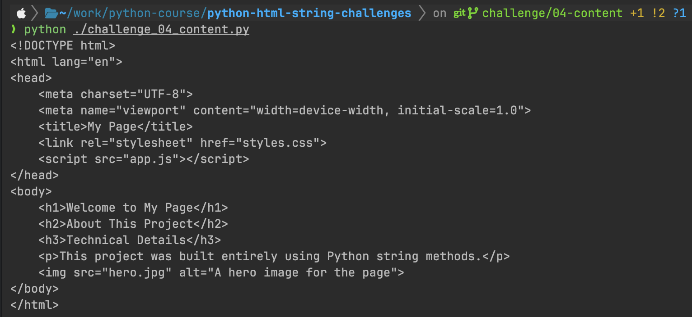
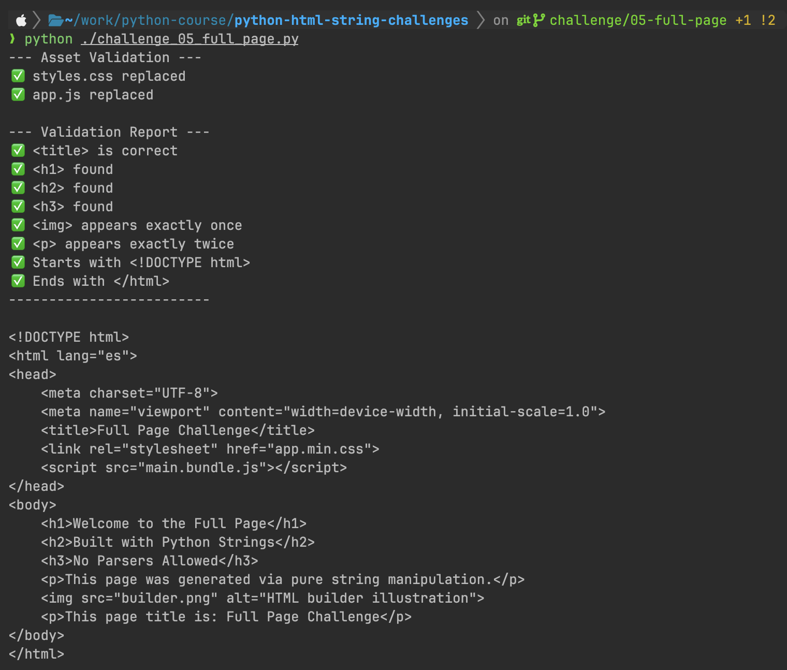

# Python HTML String Manipulation Challenges

5 Python challenges to build and modify a minimal HTML page using string methods
and concatenation only. No parsers, no libraries — pure string primitives.

## Rules
- Only string methods (.replace, .find, .rfind, .split, .index, .count, etc.) are allowed
- String concatenation with + and += is allowed
- f-strings may be used to build values before insertion
- Converting the string to a list to index elements is NOT allowed
- No imports or external libraries of any kind

## Challenges

| # | Challenge | Branch | Status |
|---|-----------|--------|--------|
| 1 | Update Page Metadata | `challenge/01-metadata` | ✅ Done |
| 2 | Update Stylesheet and Script Sources | `challenge/02-assets` | ✅ Done |
| 3 | Inject Heading Tags | `challenge/03-headings` | ✅ Done |
| 4 | Add Paragraph and Image Tags | `challenge/04-content` | ✅ Done |
| 5 | Full Page Builder | `challenge/05-full-page` | ✅ Done |

## Outputs

### Challenge 1 — Update Page Metadata

**Concepts:** `.replace()`, f-strings, string concatenation

**Solution file:** `challenge_01_metadata.py`

**HTML output file:** `html_outputs/challenge_01_output.html`

**Terminal output:**

**Browser preview:** Open `html_outputs/challenge_01_output.html` in a browser to verify
the updated `lang` attribute and `<title>` tag render correctly.

### Challenge 02 — Update Stylesheet and Script Sources

**Concepts:** `.replace()`, f-strings, string concatenation

**Solution file:** `challenge_02_stylesheets_and_scripts.py`

**HTML output file:** `html_outputs/challenge_02_output.html`

**Terminal output:**

**Browser preview:** After opening the HTML file (`html_outputs/challenge_02_output.html`) 
in a browser, use View Page Source to confirm the href and src values were updated correctly. 
Your terminal screenshot must show the printed `<link>` and `<script>` lines clearly enough to read the new filenames.

### Challenge 03 — Inject Heading Tags

**Concepts:** `.replace()`, f-strings, string concatenation

**Solution file:** `challenge_03_headings.py`

**HTML output file:** `html_outputs/challenge_03_output.html`

**Terminal output:**

**Browser preview:** Open the HTML output in a browser — the `<h1>`, `<h2>`, and `<h3>` headings 
must be visible on the page with correct visual hierarchy. A blank page usually means the heading 
tags ended up outside <body> or contain a syntax error — check the source.

### Challenge 04 — Add Paragraph and Image Tags

**Concepts:** `.replace()`, f-strings, string concatenation

**Solution file:** `challenge_04_content.py`

**HTML output file:** `html_outputs/challenge_04_output.html`

**Terminal output:**

**Browser preview:** This challenge builds on Challenge 3's output. In the browser, all headings 
and the paragraph should be visible. The `` tag will show a broken image icon since `hero.jpg` 
does not exist locally — that is expected. Use View Page Source to confirm the tag order matches 
the expected output in the challenge instructions: headings first, then `
`, then ``, all inside `<body>`.

### Challenge 05 — Full Page Builder

**Concepts:** `.replace()`, f-strings, string concatenation

**Solution file:** `challenge_05_full_page.py`

**HTML output file:** `html_outputs/challenge_05_output.html`

**Terminal output:**

**Browser preview:** Challenge 5 prints a validation report before the final HTML. Your terminal screenshot must 
capture both the validation report and the opening lines of the HTML. If your terminal window is too short to show 
everything at once, scroll up after running and take two screenshots — save them as `challenge_05_terminal_validation.png` 
and `challenge_05_terminal_html.png` and reference both in the `README` output section.

When redirecting to the HTML file, be aware that the validation report will also be written into it, which will appear 
as text at the top of the page in the browser. To save a clean HTML file, you have two options: temporarily comment out 
the `print()` calls for the validation report before redirecting, or add a second `print()` to a separate script that only 
prints the final html variable. Either approach is valid — add a comment in your code explaining which you chose.
